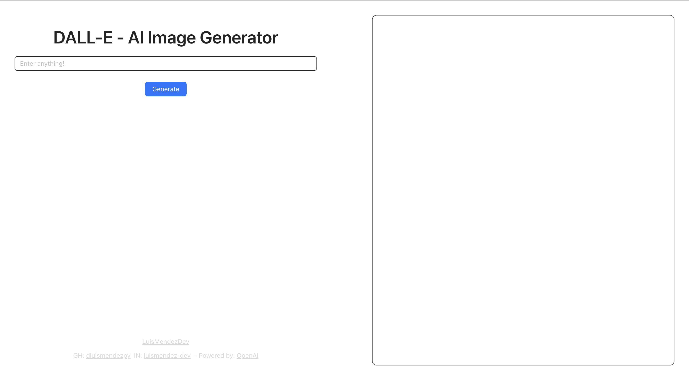
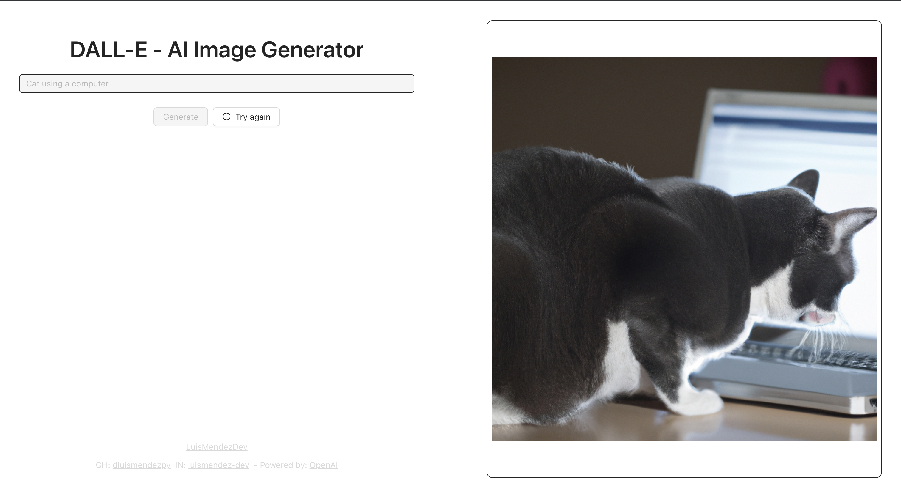

# OpenAI Client (DALL-E)

I built a Dall-E client using the OpenAI API. This allows me to easily generate unique and creative images with the
power of Dall-E's advanced language generation capabilities. With my client, I can specify the type of content I want to
generate, and Dall-E will quickly create it for me.

## Setup

#### Cone repo (HTTPS, SSH or GH)

    git clone https://github.com/dluismendezpy/openai-client.git
    git@github.com:dluismendezpy/openai-client.git
    gh repo clone dluismendezpy/openai-client

#### Install dependencies

    npm install

#### Env variables

- Create .env and add VITE_OPENAI_API_KEY=<YOUR_VITE_OPENAI_API_KEY> [Click here](https://beta.openai.com/account/api-keys)
- On Terminal, type  `export VITE_OPENAI_API_KEY=<YOUR_VITE_OPENAI_API_KEY>`

#### Start dev server

    npm run dev

### Docker commands

    export VITE_OPENAI_API_KEY=<YOUR_VITE_OPENAI_API_KEY>
    docker-compose up --build

## Examples

#### *Important*
Make sure to create your OpenAI API key in order to run this application. [Learn more](https://beta.openai.com/account/api-keys).
